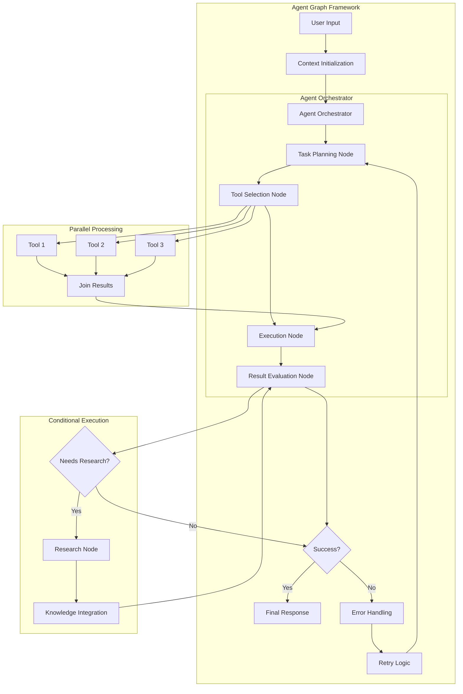

# Agent Graph ⚡️

**A minimalist, functional, and type-safe TypeScript framework for building directed computational graphs.**

Agent Graph empowers you to orchestrate complex workflows, particularly suited for LLM applications, agentic systems, data processing pipelines, and more. It emphasizes a functional approach with immutable state management, making your graphs predictable and easy to reason about.

[](LICENSE)
[](https://www.typescriptlang.org/)
[]() <!-- Replace with actual test badge if available -->

## Key Features

*   **✨ Functional & Immutable**: Design graphs with pure functions and immutable context propagation.
*   **🔒 Type-Safe**: Leverages TypeScript for robust static typing throughout the framework.
*   **🔄 Retry Logic**: Built-in, configurable retry policies (fixed, linear, exponential backoff) for resilient operations.
*   **⚡️ Batch Processing**: Efficiently process collections of items with concurrency control (sync & async).
*   **🍴 Fork/Join Patterns**: Split execution into parallel paths and merge results seamlessly (sync & async).
*   **❓ Conditional Execution**: Dynamically route execution based on context outcomes (sync & async).
*   **🚀 Async Native**: First-class support for Promise-based asynchronous operations.
*   **🛠 Extensible**: Easily create custom node behaviors and graph structures.
*   **📊 Progress Tracking**: Monitor the progress of long-running operations.
*   **🪵 Logging**: Integrated logging for execution visibility.
*   **💨 Zero Dependencies**: Lightweight and self-contained.

## Core Concepts

Agent Graph revolves around a few fundamental ideas:

1.  **Node**: The basic unit of computation. Each node represents a discrete step in your workflow. Nodes can be synchronous (`node.create()`) or asynchronous (`node.createAsync()`).
2.  **Context**: An immutable JavaScript object (`Record<string, any>`) that flows through the graph. Nodes read from and contribute to the context, but they *never* modify the incoming context directly. Instead, they return results that are merged into a *new* context object for the next step.
3.  **Executor**: Responsible for traversing the graph and executing nodes. It handles the flow of context and provides features like logging, error handling (fallbacks), and progress tracking (`executor.create()`, `executor.createAsync()`).
4.  **Graph Structures**: Combine nodes into meaningful workflows:
    *   **Pipeline (`pipe`, `pipeAsync`)**: Executes nodes sequentially.
    *   **Fork (`fork`, `parallelAsync`)**: Executes multiple nodes in parallel, each receiving a *copy* of the input context.
    *   **Join (`join`, `joinAsync`)**: Merges the results from multiple parallel paths back into a single context.
    *   **When (`when`, `whenAsync`)**: Executes a target node only if a specific condition (usually based on the previous node's `outcome`) is met.

## LLM Agent Workflow Example

Agent Graph is particularly well-suited for building LLM agent workflows. Here's a diagram illustrating how you can use the framework to create a sophisticated agent system:



### How It Works

1. **Context Initialization**: Create an initial context with user input and system parameters
2. **Task Planning**: Use an LLM to break down the task into subtasks
3. **Tool Selection**: Determine which tools are needed for each subtask
4. **Parallel Execution**: Run multiple tools concurrently when possible
5. **Result Evaluation**: Assess the quality of results and decide next steps
6. **Conditional Logic**: Branch execution based on evaluation outcomes
7. **Error Handling**: Implement retry policies for resilience

This architecture leverages Agent Graph's functional approach, making it easy to compose complex workflows while maintaining type safety and immutability.

## Installation

```bash
# Using npm
npm install graphagent

# Using yarn
yarn add graphagent

# Using bun
bun add graphagent
```

*(Note: Replace `graphagent` with the actual package name if it's different)*

## Getting Started: Simple Pipeline

```typescript
import { node, pipe, executor } from 'graphagent'; // Adjust import path if necessary

// Define a simple context type (optional but recommended)
interface MyContext {
  initialValue: number;
  step1_result?: string;
  step2_result?: number;
}

// 1. Create the first node
const node1 = node.create<MyContext>()
  .withPrepare(ctx => {
    console.log("Node 1 Prepare:", ctx);
    // Prepare data for execution (can modify context copy)
    return { ...ctx, step1_input: `Input is ${ctx.initialValue}` };
  })
  .withExecuteLogic(data => {
    console.log("Node 1 ExecuteLogic:", data);
    // Perform the core logic
    const result = `${data.step1_input}, processed!`;
    // Return results to be merged into context
    return { step1_result: result };
  })
  .withFinalize((ctx, prepareResult, executeResult) => {
    console.log("Node 1 Finalize:", ctx, prepareResult, executeResult);
    // Determine the outcome (used for conditional routing)
    return "step1_done"; // Outcome string
  });

// 2. Create the second node
const node2 = node.create<MyContext>()
  .withExecuteLogic(ctx => {
    console.log("Node 2 ExecuteLogic:", ctx);
    // Access results from previous nodes via context
    const length = ctx.step1_result?.length ?? 0;
    return { step2_result: length * 2 };
  })
  .withFinalize(() => "step2_done");

// 3. Create a pipeline to run nodes sequentially
const myPipeline = pipe(node1, node2);

// 4. Get an executor and run the pipeline
const syncExecutor = executor.create();
const initialContext: MyContext = { initialValue: 42 };

console.log("Executing pipeline...");
const finalContext = syncExecutor.execute(myPipeline, initialContext);

console.log("
Pipeline finished!");
console.log("Final Context:", finalContext);
/* Expected Output:
Executing pipeline...
Node 1 Prepare: { initialValue: 42 }
Node 1 ExecuteLogic: { initialValue: 42, step1_input: 'Input is 42' }
Node 1 Finalize: { initialValue: 42 } { initialValue: 42, step1_input: 'Input is 42' } { step1_result: 'Input is 42, processed!' }
Node 2 ExecuteLogic: { initialValue: 42, step1_input: 'Input is 42', step1_result: 'Input is 42, processed!' }

Pipeline finished!
Final Context: {
  initialValue: 42,
  step1_input: 'Input is 42',
  step1_result: 'Input is 42, processed!',
  step2_result: 52
}
*/
```

## API Examples

### Asynchronous Operations (`node.createAsync`)

```typescript
import { node, pipeAsync, executor } from 'graphagent';

interface ApiContext {
  userId: number;
  userData?: any;
  processedData?: string;
}

// Node to fetch data from an API
const fetchUserNode = node.createAsync<ApiContext, { user: any }>() // TContext, TPrepare, TExecute
  .withPrepare(async (ctx) => {
    console.log(`Preparing to fetch user ${ctx.userId}`);
    const response = await fetch(`https://jsonplaceholder.typicode.com/users/${ctx.userId}`);
    if (!response.ok) throw new Error(`API Error: ${response.statusText}`);
    return { user: await response.json() }; // TPrepare result
  })
  .withExecuteLogic(async (prepareResult) => {
    console.log(`Fetched user: ${prepareResult.user.name}`);
    // This node focuses only on fetching, return data for finalize/merging
    return { userData: prepareResult.user }; // TExecute result
  })
  .withFinalize((_ctx, _prep, execResult) => {
    return execResult.userData ? "user_fetched" : "fetch_failed";
  });

// Node to process the fetched data
const processUserNode = node.createAsync<ApiContext>()
  .withExecuteLogic(async (ctx) => {
    if (!ctx.userData) return { processedData: "No user data to process" };
    // Simulate async processing
    await new Promise(resolve => setTimeout(resolve, 50));
    return { processedData: `Processed ${ctx.userData.name}` };
  })
  .withFinalize(() => "user_processed");

const asyncPipeline = pipeAsync(fetchUserNode, processUserNode);
const asyncExecutor = executor.createAsync();

// Execute with logging
const finalApiContext = await asyncExecutor.executeWithLogging(asyncPipeline, { userId: 1 });
console.log("Async Pipeline Result:", finalApiContext);
```

### Retry Logic (`withRetry`)

```typescript
import { node, retry, executor } from 'graphagent';

let attemptCounter = 0;
const flakyNode = node.createAsync<{}, void, { success: boolean }>()
  .withExecuteLogic(async () => {
    attemptCounter++;
    console.log(`Executing attempt ${attemptCounter}...`);
    if (attemptCounter < 3) {
      await new Promise(resolve => setTimeout(resolve, 50)); // Simulate delay
      throw new Error("Temporary failure, please retry");
    }
    return { success: true };
  })
  .withRetry(retry.policy(
    4, // maxAttempts
    100, // initial delayMs
    'exponential', // backoff strategy
    (err) => err.message.includes("retry") // only retry specific errors
  ));

const result = await executor.createAsync().executeWithFallback(
  flakyNode,
  {},
  (error, ctx) => ({ ...ctx, error: error.message, failed: true }) // Fallback if retries fail
);

console.log("Retry Result:", result);
console.log(`Total attempts: ${attemptCounter}`);
```

### Batch Processing (`batch.createAsync`)

```typescript
import { node, batch, executor } from 'graphagent';

interface BatchContext {
  itemIds: number[];
  processedResults?: Record<string, any>;
}
interface BatchItem { id: number } // Input item type
interface BatchResult { id: number; value: string } // Output item type

// Node to process a single item
const itemProcessor = node.createAsync<BatchItem, { value: string }>() // TContext is the item here
  .withExecuteLogic(async (item) => {
    // Simulate async work per item
    await new Promise(resolve => setTimeout(resolve, Math.random() * 50));
    return { value: `Processed item ${item.id}` };
  })
  .withFinalize((_itemCtx, _prep, execResult) => {
     // Need to return the full result structure expected by the collector
     return { ..._itemCtx, ...execResult } as any; // A bit hacky, collector needs full item + result
  });


const batchProcessorNode = batch.createAsync(itemProcessor)
  .withConcurrency(4) // Process 4 items concurrently
  .withItemsSelector((ctx: BatchContext) => ctx.itemIds.map(id => ({ id }))) // Extract items from context
  .withResultsCollector((ctx: BatchContext, results: BatchResult[]) => {
    // Aggregate results back into the main context
    const resultMap = results.reduce((acc, res) => {
      acc[res.id] = res.value;
      return acc;
    }, {} as Record<string, any>);
    return { ...ctx, processedResults: resultMap };
  });

const batchResult = await executor.createAsync().executeWithProgress(
  batchProcessorNode,
  { itemIds: [1, 2, 3, 4, 5, 6, 7, 8] },
  (completed, total) => console.log(`Batch Progress: ${completed}/${total} items`)
);

console.log("Batch Result:", batchResult);
```

### Fork/Join (`parallelAsync`, `joinAsync`)

```typescript
import { node, parallelAsync, joinAsync, executor } from 'graphagent';

interface ForkContext {
  inputData: string;
  task1Result?: string;
  task2Result?: number;
}

// Task 1: Async string processing
const task1 = node.createAsync<ForkContext, { task1Result: string }>()
  .withExecuteLogic(async (ctx) => {
    await new Promise(resolve => setTimeout(resolve, 100)); // Simulate work
    return { task1Result: `Task 1 processed: ${ctx.inputData.toUpperCase()}` };
  });

// Task 2: Async length calculation
const task2 = node.createAsync<ForkContext, { task2Result: number }>()
  .withExecuteLogic(async (ctx) => {
    await new Promise(resolve => setTimeout(resolve, 50)); // Simulate work
    return { task2Result: ctx.inputData.length * 10 };
  });

// Define the parallel execution step
const parallelTasks = parallelAsync(task1, task2);

// Define how to join the results from parallel branches
const joiner = joinAsync.create()
  // Receives an array of context objects, one from each branch
  .withJoinFn(async (contexts: ForkContext[]) => {
    console.log("Joining contexts:", contexts);
    // Merge results manually (or use a utility)
    return contexts.reduce((acc, ctx) => ({ ...acc, ...ctx }), {} as ForkContext);
  });

const forkPipeline = pipeAsync(parallelTasks, joiner); // Usually fork is followed by join

const forkResult = await executor.createAsync().execute(
  forkPipeline,
  { inputData: "hello" }
);

console.log("Fork/Join Result:", forkResult);
```

### Conditional Execution (`whenAsync`)

```typescript
import { node, whenAsync, pipeAsync, executor } from 'graphagent';

interface ConditionalContext {
  value: number;
  status?: 'valid' | 'invalid';
  processedValue?: number;
  errorMessage?: string;
}

// Node to validate input
const validator = node.createAsync<ConditionalContext>()
  .withExecuteLogic(async (ctx) => ({ status: ctx.value > 50 ? 'valid' : 'invalid' }))
  .withFinalize((_ctx, _prep, execResult) => execResult.status ?? 'error'); // Outcome based on status

// Node to process if valid
const processNode = node.createAsync<ConditionalContext>()
  .withExecuteLogic(async (ctx) => ({ processedValue: ctx.value * 2 }))
  .withFinalize(() => "processed");

// Node to handle if invalid
const errorNode = node.createAsync<ConditionalContext>()
  .withExecuteLogic(async (ctx) => ({ errorMessage: `Value ${ctx.value} is too low` }))
  .withFinalize(() => "handled_error");

// Pipeline with conditional branches
const conditionalPipeline = pipeAsync(
  validator,
  whenAsync("valid", processNode),   // Runs if validator outcome is "valid"
  whenAsync("invalid", errorNode) // Runs if validator outcome is "invalid"
);

// Test with valid input
const resultValid = await executor.createAsync().execute(conditionalPipeline, { value: 75 });
console.log("Conditional (Valid):", resultValid);

// Test with invalid input
const resultInvalid = await executor.createAsync().execute(conditionalPipeline, { value: 25 });
console.log("Conditional (Invalid):", resultInvalid);
```

## Testing

Run the test suite using Bun:

```bash
bun test
```

## Contributing

Contributions are welcome! Please feel free to open an issue or submit a pull request.

1.  Fork the repository.
2.  Create your feature branch (`git checkout -b feature/my-new-feature`).
3.  Commit your changes (`git commit -am 'Add some feature'`)
4.  Push to the branch (`git push origin feature/my-new-feature`).
5.  Open a pull request.

## License

This project is licensed under the MIT License - see the [LICENSE](LICENSE) file for details.
